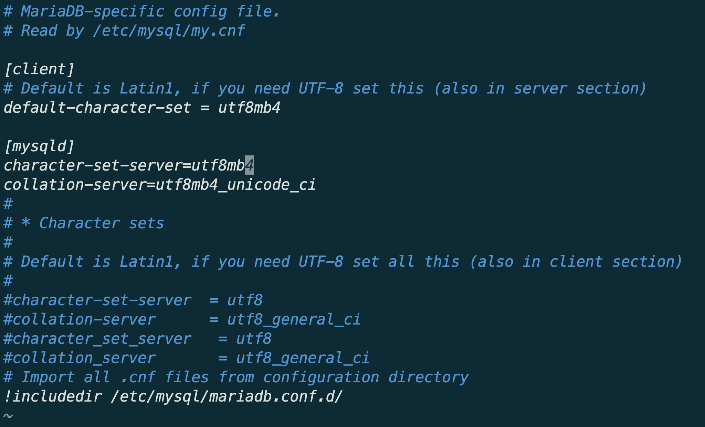

# ❎ 에러 발생

docker image로 mariadb를 사용하면서 한글 데이터를 insert하는 순간 다음과 같은 에러를 만났다.


> ERROR 1366 (HY000) : incorrect string value : for column


에러 문구와 상황을 보았을 때, 인코딩과 관련된 문제라는 것을 알았는데, 여기서 정말 고생을 했다.

**여러 사람들의 글을 참고했는데, characterset encoding을 utf8로 바꾸라고 하는 해결글들을 따라해보았지만 해결이 되지 않았고, 결론적으로 mysql character-set 설정과 collation 설정을 utf8mb4로 맞춰줘야 문제가 해결이 되었다.**

mysql에서 쓰는 utf8은 최적화를 위해 3byte를 쓰고 있는 utf8 변종이였다. 우리가 일반적으로 알고 있는 utf8이 아니였고, 이모지 등의 문자가 들어갈 경우 문자가 깨지는 문제가 있을 수 있다고 한다. 하지만 그렇다고 하더라도 현재 상황은 한글을 저장하려고 했던건데 왜 문제가 되었을까 생각을 해 보았을 때 다음과 같은 이유가 아닐까 생각했다. 정확히 위의 에러가 생긴 상황은 카카오 api를 통해 받아온 회원 정보를 우리 서버에 저장을 할 때 문제가 되었는데 카카오에서 보내준 회원 정보(한글)가 아마도 단순한 한글 데이터(이모지 포함..?)가 아니였기 때문에 mysql utf8에서 문제가 되지 않았을까 추측이 된다.

[mysql utf8에서 utf8mb4 마이그레이션 방법](https://www.letmecompile.com/mysql-utf8-utf8mb4-migration/)

# 🌟 해결

docker (mysql)에서 /etc/mysql/mariadb.conf에서 아래와 같이 설정을 바꿔주었다.

아마존 rdb 인스턴스에서는 db의 character-set과 collation을 바꿔주는 ui를 제공해주는데 아래의 글을 보고 utf8mb4 관련 설정으로 모두 바꿔주었다.

[AWS RDS 한글 설정](https://designdevelop.tistory.com/68)