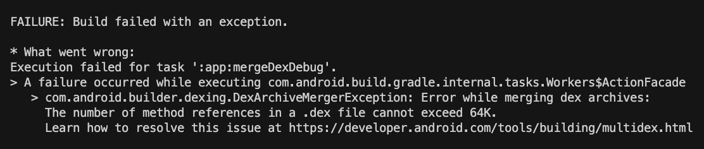

# ❎ 에러 발생

react-native 앱 테스트를 안드로이드 에뮬레이터로 사용하고 있었는데 갑작스레 다음과 같은 에러를 만났다.




* What went wrong:
Execution failed for task ':app:mergeDexDebug'.
> A failure occurred while executing com.android.build.gradle.internal.tasks.Workers$ActionFacade
com.android.builder.dexing.DexArchiveMergerException: Error while merging dex archives:
The number of method references in a .dex file cannot exceed 64K.
Learn how to resolve this issue at https://developer.android.com/tools/building/multidex.html


# 🌟 해결

[https://developer.android.com/studio/build/multidex](https://developer.android.com/studio/build/multidex)를 보면 minSdkVersion이 20 이하로 설정되어 있으면 multidex 지원 라이브러리를 사용해야 한다.

multidex 지원 라이브러리를 추가해도 되고, 저는 minSdkVersion을 21로 올려 해결했습니다.

android/app/build.gradle

```bash
android {
      defaultConfig {
         ...
         # minSdkVersion 16
         minSdkVersion 21
         ...
      }
   }
```