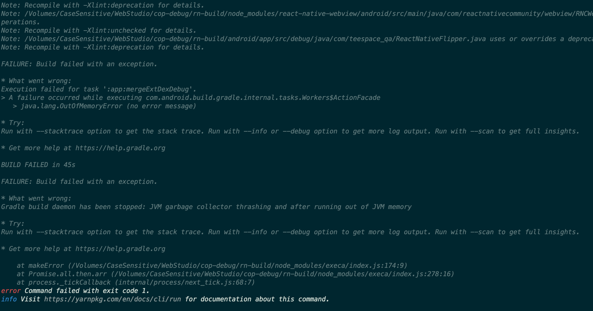

# ❎ 에러 발생

react-native 앱 테스트를 안드로이드 에뮬레이터로 사용하고 있었는데 갑작스레 다음과 같은 에러를 만났다.

> "Execution failed for task ':app:mergeExtDexDebug'."
> ...
>\> A failure occured while executing com.android.build.gradle.internal.tasks.Workers$ActionFacade
    >>\> java.lang.OutOfMemoryError (no error message)

> What went log:
Gradle build damon hase been stopped: JVM garbage collector thrashing and after running out of JVM memory

[해결 방법](https://stackoverflow.com/questions/59624003/daemon-is-stopping-immediately-jvm-garbage-collector-thrashing-and-after-running)

# 🌟 해결

android 폴더안의 gradle.properties 파일안에

- org.gradle.jvmargs=-Xmx4096M

entry를 추가해주니 해결되었다.

추가적으로 java heap space가 모자르다는 에러가 난다면 아래도 추가해주면 된다.

android/app/src/main/AndroidManifest.xml 파일에서 <application> </applicaiton> 태그안에 아래 entry 추가

- android:largeHeap="true"
