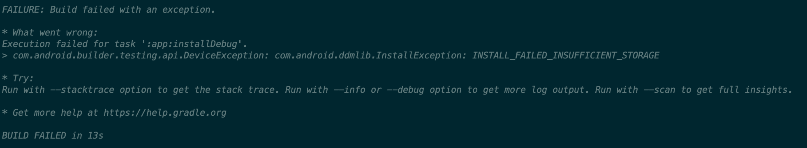
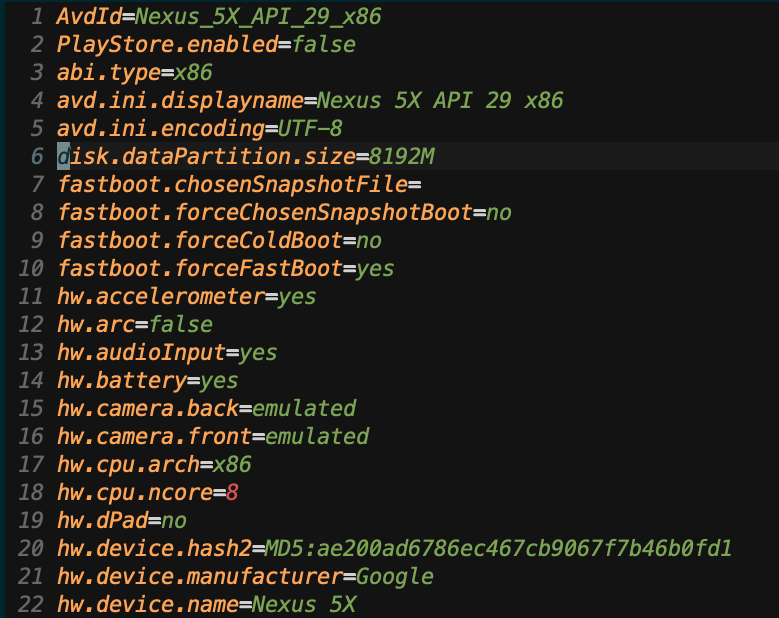

# ❎ 에러 발생

react-native 앱 테스트를 안드로이드 에뮬레이터로 사용하고 있었는데 갑작스레 다음과 같은 에러를 만났다.

에뮬레이터에서 용량이 충분하지 않아 문제가 생기는데 여러 글을 찾아보니, 캐쉬때문에 앱을 껏다가 키는 방법 등을 말해주었는데

근본적으로 에뮬레이터의 internal storage를 늘릴 수 있는 방법이 있을 것 같아 찾아보다가 구글에서 다음 글을 보고 해결했다.

[해결 방법](http://www.coderprof.com/Android_Questions/Android_Questions.php?Android_Questions=5642&Question=Android+%EC%97%90%EB%AE%AC%EB%A0%88%EC%9D%B4%ED%84%B0%EC%9D%98+%EC%A0%80%EC%9E%A5+%EC%9A%A9%EB%9F%89%EC%9D%84+%EB%8A%98%EB%A6%AC%EB%8A%94+%EB%B0%A9%EB%B2%95%EC%9D%80+%EB%AC%B4%EC%97%87%EC%9D%B8%EA%B0%80%EC%9A%94?+(INSTALL_FAILED_INSUFFICIENT_STORAGE))

# 🌟 해결

~/.android/avd/Nexus_5X_API_29_x86.avd/ 폴더안의 config.ini에

disk.dataPartition.size 값을 높이면 이제 문제가 생기지 않는다.