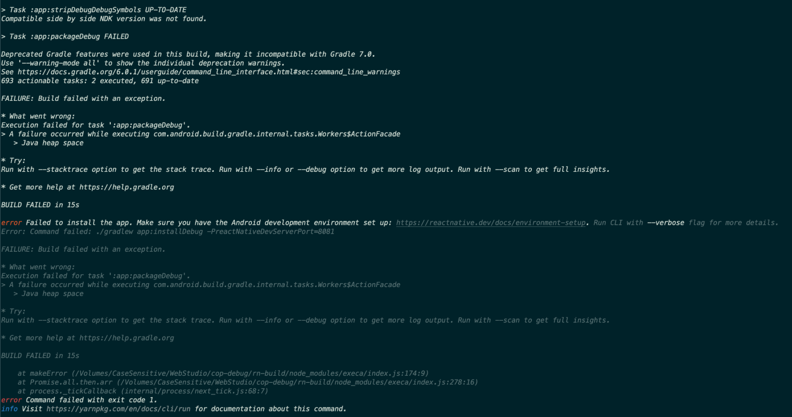

안드로이드 에뮬레이터를 사용하다가 다음과 같은 에러를 만났다.

> "Execution failed for task ':app:packageDebug'."
> ...
>\> A failure occured while executing com.android.build.gradle.internal.tasks.Workers$ActionFacade
    >>\> Java heap space

에러 문구로 유추하건데.. Java의 힙 메모리가 부족하다는 에러로 유추해보고 찾은 결과 react-native github issue를 보고 따라해 문제를 해결할 수 있었다.

[해결 방법](https://github.com/facebook/react-native/issues/6799)

# 해결

android/app/src/main/AndroidManifest.xml 파일에서 <application> </applicaiton> 태그안에

- android:largeHeap="true"

entry를 추가해주니 해결되었다.
