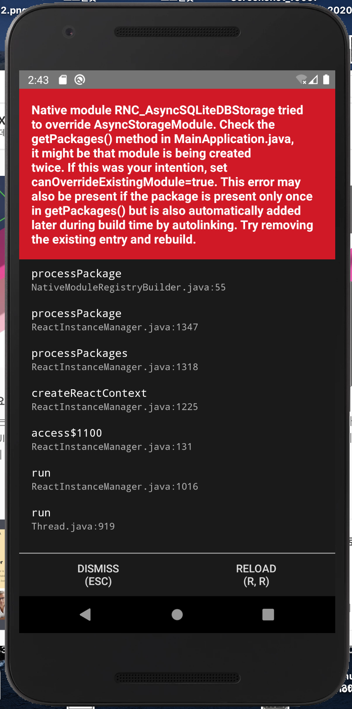

# ❎ 에러 발생

AsyncStorage 위치가 변경되었다는 워닝이 떠서 다른 @react-native-community/async-storage로 새로 설치했다. 하지만 기존의 async-storage를 지우지 않으면서 packages가 android에 중복되어 설치되어 해당 에러가 생기게 되었다.

# 🌟 해결

async-storage 관련한 이전 모듈을 지우고 다시 빌드하니 해결 되었다.
