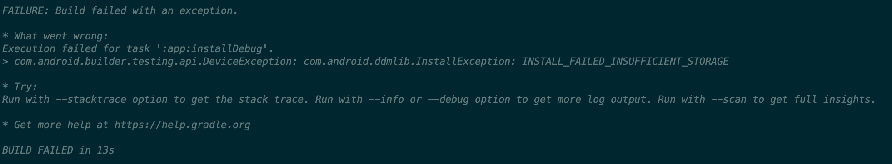
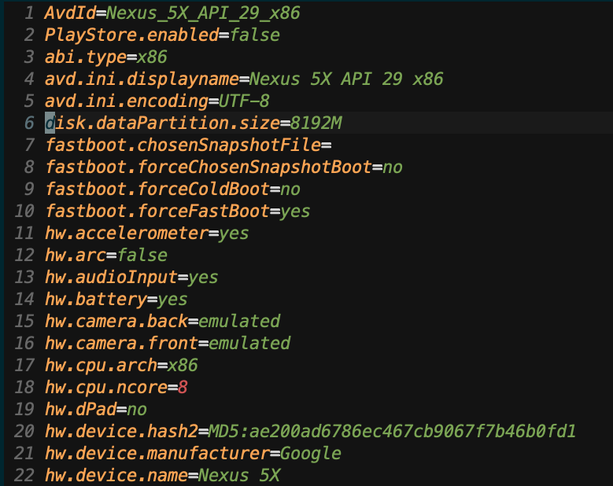

안드로이드 에뮬레이터를 사용하다가 다음과 같은 에러를 만났다.

에뮬레이터에서 용량이 충분하지 않아 문제가 생기는데 여러 글을 찾아보니, 캐쉬때문에 앱을 껏다가 키는 방법 등을 말해주었는데

근본적으로 에뮬레이터의 internal storage를 늘릴 수 있는 방법이 있을 것 같아 찾아보다가 구글에서 다음 글을 보고 해결했다.

[해결 방법](http://www.coderprof.com/Android_Questions/Android_Questions.php?Android_Questions=5642&Question=Android+%EC%97%90%EB%AE%AC%EB%A0%88%EC%9D%B4%ED%84%B0%EC%9D%98+%EC%A0%80%EC%9E%A5+%EC%9A%A9%EB%9F%89%EC%9D%84+%EB%8A%98%EB%A6%AC%EB%8A%94+%EB%B0%A9%EB%B2%95%EC%9D%80+%EB%AC%B4%EC%97%87%EC%9D%B8%EA%B0%80%EC%9A%94?+(INSTALL_FAILED_INSUFFICIENT_STORAGE))

# 해결

~/.android/avd/Nexus_5X_API_29_x86.avd/ 폴더안의 config.ini에

disk.dataPartition.size 값을 높이면 이제 문제가 생기지 않는다.