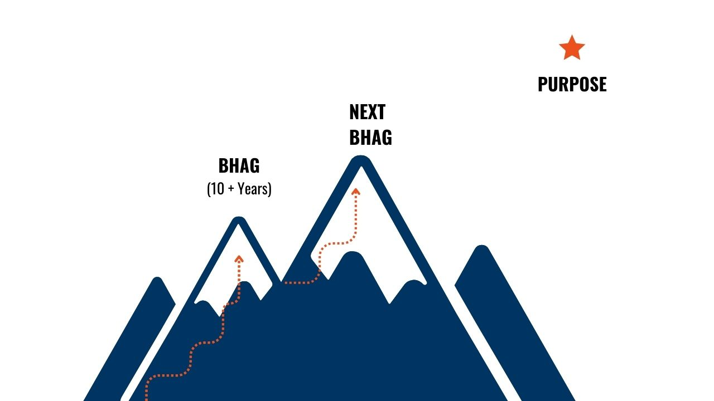
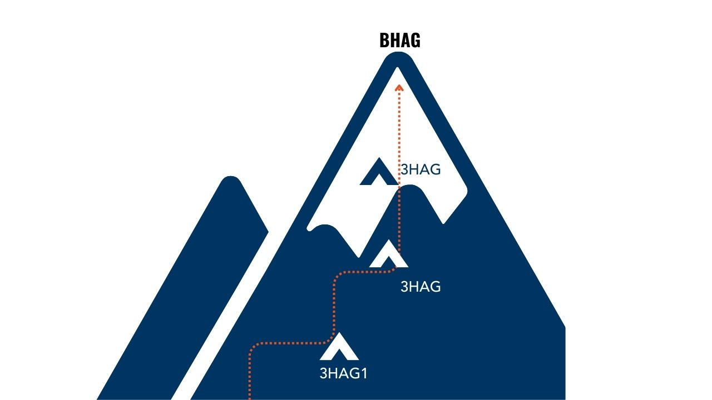

최근에 회사내에서 COO님과 이야기하다가 에어스메디컬에서 제일 팀 운영을 잘 한다는 이야기를 듣고 싶어서 더 열심히 해보려구요! 라는 말을 했는데, COO님이 짐 콜린스의 **좋은 리더를 넘어 위대한 리더로** 라는 책을 추천을 해주셔서 읽게 되었다. 책을 모두 읽고나니, 머리를 한대 맞은 기분이 들 정도로 너무 좋은 내용들이 많았고 이래서 책을 읽는구나 라는 생각을 하게 되었고, 개인적으로 현재 팀 리딩하시는 분들 모두에게 정말 강력 추천드리고 싶은 책이다.

여기 책에서는 리더십을 한마디로 설명하고 있다.

- **리더십은 당연히 수행되어야 할 일을 사람들이 자발적으로 나서서하게 만드는 기술이다.**

결국 짐 콜린스 & 포라스의 비전 프레임워크 등 많은 내용들이 있었지만, 이것을 위해서 할 수 있는 방법들 대해 위대한 기업과 리더들이 어떻게 잘 했는지 그리고 이제 어떻게 해야하는지 알려주는 책이다.

사실 노션에 팀 운영이나 회사적으로 같이 이야기해 볼만한 내용들 적고 있었는데 적다보니 거의 필사를 하고 있는 저를 발견했는데 COO님도 그랬다고 하셔서 많이 공감되었다.

여기에는 제가 그중에서도 제일 마음에 와닿았던 내용들만 먼저 기록으로 남겨보려고 한다.

## 비전의 중요성

짐 콜린스는 비전 프레임워크를 만들어 기업들이 쉽게 비전을 설정 가능하도록 만들었다.

비전은 핵심 가치관과 믿음, 목적, 사명 (BHAG) 3가지 요소로 구성된다.

핵심 가치관과 믿음은 개개인의 인생 철학과도 같다. 인생을 살아가는 자신만의 지침이자 지도 철학이라고 부른다고 한다.

목적은 기업의 존재 이유다. 늘 추구하지만 결코 달성되지 않는 지향점이다. 스티브잡스는 목적과 관련해 다음과 같은 말을 남겼다고 한다.

> 나는 내가 언젠가 그 모든 것을 끝낼 수 있을 거라고 생각하지 않습니다. 세상에는 많은 장애물이 있고, 또 내가 평생 달려가도 도달하지 못하는 장애물은 늘 있게 마련입니다. 하지만 중요한 것은 내가 그것을 향해서 계속 노력한다는 사실입니다.

BHAG란 Big(원대하고) Hairy(위험하며) Audacious(대담한) Goals(목표)의 머리글자를 모아서 만든 약어다.

이 BHAG는 10~25년동안 달성할 목표로 세우고, 그리고 BHAG를 달성하기 위해 HAG라는 베이스 캠프 (3~5년 목표)를 세워야 한다.

그리고 회사의 리더가 각 HAG를 전략적으로 세우고 각 팀별로 HAG로 가는데 기여할 수 있는 단위부서 HAG를 세울 수 있다.

이 비전이 팀원들에게 각인 되면 마이크로 매니징이나 꽉 죄는 규율없이도 스스로 목표를 달성하기 위한 테스트를 생각해 나갈 수 있고 집중 할 수 있다. 그리고 팀원 모두가 하나의 목표로 달려가고 있다는 공동체 의식을 가질 수 있다. 모두 하나의 목표로 달려갈 수 있다. 목표를 향해 가는 방법은 다양하다. 이것들을 모두 획일화하는거는 힘들기도 하고 말이 되지 않는다.

비전이 가져다주는 좋은 점은 아래와 같다.

> 1. 비전이 있으면 좀처럼 볼 수 없는 노력을 기울이게 된다.
> 2. 비전이 있으면 전략적, 전술적 결정을 내릴 수 있는 상황을 스스로 만들어나간다.
> 3. 비전을 공유하면 직원이 서로 단결하고 팀워크를 이루며 한 가족처럼 지낸다.
> 4. 비전이 있으면 소수의 핵심 인물에만 의존했던 기업을 많은 사람이 참여할 수 있는 기업으로 성장, 발전시킬 수 있다.

실제로 지금 다니는 에어스에서는 이번년도부터 전사 목표를 3가지 공표하고, 이 내용들에 기여할 수 있는 팀 목표를 또 다시 3가지씩 정하고, 팀 목표에 기여할 수 있는 개인별 목표들을 정하는 것을 진행하고 있다. 이미 우리 회사에서는 하고 있던 내용이라는걸 알게 되었다. 그리고 실제로 이렇게 진행을 하면서 각 팀별로 팀 목표를 세운 내용들을 각 팀장님들이 돌아가며 전사 타운홀 때 발표를 했는데 모두가 하나의 목표를 위해 달려가는 원팀이라는 느낌을 굉장히 크게 느낄 수 있었던 점에서 정말 재미있는 경험이었고 이 책의 내용에 매우 공감한다.

추가적으로 이번 1년을 해보면서 느낀 점은 에어스에서 개인 및 팀 목표 달성 여부로 리뷰 및 평가를 어느정도 반영하기 때문에 당연히 동기부여가 될 수 있다고 생각하지만 (실제로 이런 부분도 책에 소개되어 있습니다.) 이것과 병행해서 챌린징한 팀 목표를 달성했을때 팀 회식 지원 등과 같은 목표 달성에 대한 소규모 보상 부분이 있다면 팀원들과 같이 팀 목표를 달성하는 것을 재미있게 느끼고 다 같이 으쌰으쌰 할 수 있는 긍정적인 분위기를 만들 수 있을 것 같다고 생각이 들었다. 사소하다면 사소하지만 또 아주 재미있는 문화가 되지 않을까 생각해본다!

## 삶을 살아가는 2가지 길 (신뢰의 선순환)

책에서는 짐 콜린스와 그의 스승 빌 레지어와 문답을 하는 내용이 있다. 짐 콜린스가 스탠포드를 떠나서 창업을 하면서 사람들에게 많이 데이고 사람을 믿는게 맞는지 스승과 무섭게 문답을 하는 내용이 있다.

그리고 빌 레지어는 세상을 살아가는 방법이 2가지가 있다고 하며 아래처럼 이야기를 한다.

> 우리 앞에는 두 가지 길이 있다. 어떤 사람이 ‘믿을 만하다’고 생각한다면, 그 판단이 잘못되었다는 명백한 증거가 나오기 전까지 그 믿음을 계속 붙잡고 가는 길. 또 어떤 사람이 ‘믿을 수 없다’고 생각한다면, 그 판단이 잘못되었다는 명백한 증거가 나오기전까지 그 믿음을 계속 붙잡고 가는 길.

> 누군가를 신뢰하고 그 사람이 그 신뢰를 받을 자격이 있다면, 이것은 엄청나게 긍정적인 효과를 불러온다. 신뢰를 받은 그 사람은 자신이 인정을 받고 있다는 사실만으로도 긍정적인 방향으로 동기를 부여받는다. 믿음이 틀렸을 경우에 발생할 부정적인 효과는 무엇일까? 쉽게 받아들일 수 없는 손실을 당하면, 누구나 고통과 실망감을 느끼게 된다.

> 그렇다면 불신이 가져다주는 이득은 무엇일까? 불신은 고통과 실망을 최소한으로 줄여 준다. 불신에 뒤따르는 손해는 무엇일까? 빌은 이 부분이 중요하다고 조언했는데, 만일 우리가 주변에 있는 사람들을 신뢰할 수 없다고 결론내린다면, 결국 그들은 의욕을 잃고 우리를 떠나가게 된다. 바로 이것이 빌이 말하는 신뢰 베팅(Trust Wager) 즉 신뢰에 내기를 걸라는 원칙의 핵심이다. 이는 다른 사람들과 무언가를 도모할 때 불신보다는 신뢰를 보내는 것이 잃는 것보다 얻는 것이 많다는 확고한 믿음을 기반으로 한 원칙이다.

여기서 짐 콜린스와 빌 레지어는 결국 어떤 사람이 ‘믿을 만하다’고 생각한다면, 그 판단이 잘못되었다는 명백한 증거가 나오기 전까지 그 사람을 믿어야 한다고 이야기를 합니다. 그 이유는 위와 더불어 그 사람이 또 믿는 만큼 성장을 하기 때문이다. 그리고 기본적으로 사람은 믿어주는 사람을 실망시키지 않기 위해 더 열심히 하려고 한다고 말한다.

> 그러나 결국 우리는, 다른사람들이 우리에게 의지할 때 즉 그들을 실망시킬 수 없을 때, 최선을 다한다.

전에 미라이 공업이라는 회사에서 선풍기 승진이라는 말을 듣고 찾아보았는데 이것과도 어떻게보면 같이 이어지는게 아닐까 싶다. 모든 직원들은 같이 일하고 싶다고 믿었기때문에 같이 한 사람들이니까!

> 선풍기 승진: 1991년경 미라이 공업이 상장을 하기 위해 딱 한 번 **선풍기로 승진** 시킨 적이 있었다. 일본 [대장성](https://namu.wiki/w/%EC%9D%BC%EB%B3%B8%20%EC%9E%AC%EB%AC%B4%EC%84%B1)(Ministry of Finance)은 미라이 공업의 규모상 적어도 '과장'[[13]](https://namu.wiki/w/%EB%AF%B8%EB%9D%BC%EC%9D%B4%20%EA%B3%B5%EC%97%85/%EA%B2%BD%EC%98%81#fn-13)이 65명 이상이어야 하며 경리과장과 구매과장이 없는 것은 지나치게 부실하다는 이유로 상장을 거절했다. 당시 미라이 공업에는 [과장](<https://namu.wiki/w/%EA%B3%BC%EC%9E%A5(%EC%A7%81%EC%9C%84)>)이 20여명밖에 없었는데, 인건비 절감을 위해 [중간관리직](https://namu.wiki/w/%EC%A4%91%EA%B0%84%EA%B4%80%EB%A6%AC%EC%A7%81)을 최소화했기 때문이었다. 하지만 상장을 하기는 해야 했기 때문에 직원 이름을 적은 종이를 쌓아두고 선풍기를 틀었고 가장 멀리 날아간 사람 45명을 뽑아 승진시켰다(…). [~~양주동](https://namu.wiki/w/%EC%96%91%EC%A3%BC%EB%8F%99)?~~ 이에 대해 야마다 아키오는 “승진한 사람은 운이 좋았지만 정부가 별걸 다 요구했다”고 비판했다. 당시 한 직원은 입사 1년만에 선풍기의 선택에 의해 과장으로 승진했으며, 그 후 18년 이상이 지났음에도 승진한 적이 없다고 한다.[[14]](https://namu.wiki/w/%EB%AF%B8%EB%9D%BC%EC%9D%B4%20%EA%B3%B5%EC%97%85/%EA%B2%BD%EC%98%81#fn-14)그러나 이는 미라이 공업의 선풍기 승진에서 18년이 지난 2009년에 [\*\*통계역학](https://namu.wiki/w/%ED%86%B5%EA%B3%84%EC%97%AD%ED%95%99)(물리학)적으로 랜덤으로 승진시키는 게 성과가 더 좋다는 게 증명되었다\*\*. [[15]](https://namu.wiki/w/%EB%AF%B8%EB%9D%BC%EC%9D%B4%20%EA%B3%B5%EC%97%85/%EA%B2%BD%EC%98%81#fn-15) 이 연구는 [이그노벨상](https://namu.wiki/w/%EC%9D%B4%EA%B7%B8%EB%85%B8%EB%B2%A8%EC%83%81) 경영학상(2010)을 수상했다.

출처: [https://namu.wiki/w/미라이 공업/경영#:~:text=선풍기 승진%3A 1991,2010](https://namu.wiki/w/%EB%AF%B8%EB%9D%BC%EC%9D%B4%20%EA%B3%B5%EC%97%85/%EA%B2%BD%EC%98%81#:~:text=%EC%84%A0%ED%92%8D%EA%B8%B0%20%EC%8A%B9%EC%A7%84%3A%201991,2010))

팀원들을 믿기로 했다면 믿어야 한다. 특별한 계기가 없는 한!

# 창의성과 규율이 공존하게

위대한 기업이 되기 위해서, 창의성을 위해, 팀원들에게 자율성을 보장해야하지만 (원격 근무와 같은 방식 적극 권장!) 위대한 기업이 창의성만으로 이루어지는 것은 아니고 이게 확장되기 위해서는 규율이 필요하다고 이야기한다. 그렇다고 마이크로 매니징을 하면 절대 안된다. 이러면 자율성을 해치게 된다.

> 혁신 그 자체가 가져다주는 경쟁우위 효과는 제한적이다. 새로운 사업 분야에서 선구적인 혁신가가 마침내 위대한 승리자가 되는 경우는 채 10퍼센트도 안 된다.

> 기업이 가진 기본적인 힘음 탄탄한 혁신 역량만이 아니다. 진정한 힘은 혁신을 확장하는 능력에서 나온다.

> 혁신을 복제하고 또 이것을 확장하며 전술적인 탁월함을 끝까지 지켜나갈 수 있는 철저한 규율을 갖춘 조직을 구축하는 데에도 집중해야 한다. 장기적으로 보면

> ‘최상’이 ‘최초’를 이기게 마련이다.

> 그리고 최고의 규율 문화는 가치관과 책임을 규정하는 틀 안에서의 자유를 의미한다.

> 틀 안에서의 실수는 자율적인 선택으로 보아야 할 부분이고, 그것을 어떻게 극복해 나가는지 지켜보아야 하며, 훌륭히 수행하는 모습에 아낌없는 격려를 해주어야 하는 일이다.

그리고 짐 콜린스는 책에서 자주 리더를 선생님, 팀원 혹은 직원을 학생으로 생각하는 비유를 들곤한다.

> 위대한 리더는 훌륭한 교사처럼 직원들을 이상화하고, 그들이 그 이상의 수준에 도달할 수 있다는 확고한 신념을 가지고 있다. 직원들의 정신을 붙잡고, 앞으로 이끌며, 일깨운다. 자신이 직원을 바라보는 바로 그 방식으로 직원들이 자기 자신을 이상화하도록 한다. 위대한 리더는 다음과 같은 메시지를 전달한다.

> 우리는 크고 위험한 목표를 끝내 달성할 것이다. 우리는 이 일을 해내리라고 믿는다. 왜냐하면 내가 여러분을 믿기 때문이다.

> 훌륭한 교사라면 학생들이 대체로 어려운 과제에 도전하기를 바라며, 기대치가 높을 때 거기에 걸맞은 결과를 보여준다는 사실을 알고 있다.

> 좋은 교사와 마찬가지로 좋은 리더는 출신 계층, 배경에 상관없이 누구나 높은 성과를 낼 수 있으며, 마음속으로는 다들 그렇게 하고 싶어 한다고 가정한다. 위대한 리더는 높은 성과를 요구하지 않는다. (요구한다는 표현에는 직원들이 기본적으로 게을러서 최선의 노력을 하지 않는 경향이 있다는 암시가 내포되어 있다. 그렇지만 만약 이런 태도를 가진 이들이 있다면 썩은 이빨을 뽑듯이 이런 태도를 버리도록 해야한다.) 다만 위대한 리더는 직원들에게 테스트하고 성장하고 또 최선을 다할 기회를 제공한다.

정말 신기한건 이 틀안에서의 자유를 찾아보다가 "프랑스 아이처럼 - 아이, 엄마, 가족이 모두 행복한 프랑스식 육아” 에 다룬 책에서도 이런 내용을 다루고 있다는 것을 알게 되었다.

> _우리는 아이들이 부모로부터 엄격히 통제 받지 않고 암묵적으로 허용되어진 상태에서 공공장소에서 마음껏 소리치며 다니는 아이들을 어렵지 않게 보게 되는데 이는 참다운 육아가 아니라는 교훈을 얻게 되었다. 프랑스 육아법의 특징은 ‘카드르(cadre, 틀)’ 안에서 엄격하게 키우는 동시에 그 틀 안에서는 아이들이 마음껏 자유를 누릴 수 있게 해 주는 것이다. 예를 들면, 아이들이 식사시간과 공부시간을 철저하게 지키게 하는 동시에, 나머지 시간은 자유롭게 보내게 해 주는 식이다._

출처: http://www.mokposm.co.kr/news/articleView.html?idxno=5750

위대한 기업, 리더라는 것이 훌륭한 교사 및 멘토 그리고 육아법으로 모두 통한다는게 정말 신기했다.

팀에 의미있는 창의성이라는것이 꼭 자율성만 보장된 상황에서 나오는 것이 아니라 서로간의 어느정도 신뢰를 가질 수 있는 틀 안에서 서로간의 신뢰안에서 나올 수 있다고 생각이 들었다.

> 그리고 최고의 규율 문화는 가치관과 책임을 규정하는 틀 안에서의 자유를 의미한다.

> 틀 안에서의 실수는 자율적인 선택으로 보아야 할 부분이고, 그것을 어떻게 극복해 나가는지 지켜보아야 하며, 훌륭히 수행하는 모습에 아낌없는 격려를 해주어야 하는 일이다.

현재 개발팀의 경우 재택 근무를 할 수 있는데, 이 문화가 잘 지켜질 수 있는 최소한의 틀로 불가피한 상황이 아닌 한 오전 9시전까지는 재택 및 휴가 여부를 이야기 해달라고 하고 있는데 이런 부분들을 더 잘 지킬 수 있도록 해야겠다는 생각이 들었다.

그리고 책에서 마감기한을 또 하나의 중요한 틀로 이야기하고 있는데, 이 틀을 팀원들이 정하고 그것을 최대한 보장해주도록 노력해야 한다고 한다.

현재 회사에서는 스프린트를 아래처럼 진행을 하고 있는데 설계주에 각 팀원 개발자분들이 스프린트 백로그에 대한 설계를 진행하며 며칠이 걸릴지 스스로 스토리 포인트를 설정하고 해당 포인트안에 개발을 진행한다.

이런 부분들도 모두 하나의 자율성을 보장하는 틀이 아닐까라는 생각이 들면서 이런 문화가 더 잘 유지될 수 있도록 해야겠다는 마음을 다시 한번 먹게 되었다.

최근에 (이미 2달전이긴 하지만) 딜라이트 룸 팀의 서승환 이준원님의 [**소수 인원으로 글로벌 1위 앱 서비스를 만든 비결**](https://www.linkedin.com/posts/joonwon-lee-035987119_%EB%A7%88%EA%B0%90-%EB%90%98%EC%97%88%EC%8A%B5%EB%8B%88%EB%8B%A4-activity-7228781357491965952-NQAL?utm_source=share&utm_medium=member_desktop)이라는 세미나를 신청해 듣고 왔는데 정말 많이 배울 수 있는 세미나였다. 갔다온 후에 개발팀과 pm/po팀과 현재 스프린트 방법에 대해 많이 논의를 했고 스토리포인트 단위를 하루 단위에서 시간단위로 변경했고, 최대 16시간 이하로만 산정하도록 기준을 바꾸었다. 16시간 이상으로 설계한 내용이라면 분명히 잘못 설계되었다는 가정이 있다. 더 세세한 단위로 스토리 포인트를 산정해야 스프린트 회고도 각 백로그별로 더 의미있게 할 수 있을 것 같다는 생각이 들었고, 의미있는 회고를 통해 더 발전하는 스프린트 문화를 만들려고 한다.

## 함께 산을 오를 사람은 누구인가

위대한 리더는 어떤 일을 잘 하는 능력보다도 그 사람이 좋은 사람인지에 집중한다고 한다. **First Who, Then What**

> 위대한 기업의 요건이 무엇인지 25년 넘게 곰곰이 되짚어보면서 나는 ‘사람 먼저라는 원칙이 다른 어떤 것보다 중요하며 또한 절대로 놓쳐서는 안 되는 유일한 원칙임을 깨달았다.

> 다시 말하면 사람이 먼저이고 그 다음이 사업이라는 원칙 **First Who, Then What**을 확인했다.

> 사람이 먼저이고 일은 그 다음이다 (제대로 된 사람들을 골라서 버스에 태운다)

그리고 이것과 함께 책에서 소개하는 가장 중요한 단 하나의 경영 지표로 하나를 꼽는다. 팀 경영 지표로도 생각할 수 있을 것 같다.

> 버스의 주요 좌석이 올바른 (적합한) 인재로 채워진 비율이다. (최소 90%이상)

> 높은 기준을 달성해야만 하는 자리에 올바른 직원들을 앉혀라. 그리고 그 일을 잘 해낼 수 있다는 믿음을 전달하라.

사람이 먼저다. 중요한 자리에 좋은 사람들이 얼만큼의 비율로 있는지 지속적으로 체크하는게 중요하다.

그리고 이 자리에 앉은 사람이 보통 성장하기를 기다리다가 오랜 정과 아끼는 마음으로 인해 한계 타이밍을 놓치는 때가 온다고 한다. 그래서 아래와 같은 판단 근거를 제시해주고 있다. 하지만 항상 정답은 없다.

> 1. 그 사람을 그 자리에 계속 둔다면 다른 사람을 잃게 될까?
> 2. 그 사람은 가치관, 의지 혹은 기술과 관련된 문제를 가지고 있는가?
> 3. 그 사람은 언제 창문 바깥을 바라보고 또 언제 거울을 바라보는가?
> 4. 그 사람이 직무를 일로 바라보는가, 아니면 책임으로 바라보는가?
> 5. 그 사람에 대한 신뢰가 지난 1년 동안 높아졌는가, 낮아졌는가?
> 6. 그 사람을 올바른 좌석에 앉혔는가?
> 7. 만일 그 사람이 그만둔다고 한다면 어떤 기분인가?

가끔 회사에서 일을 할때면 정말 힘들때도 많지만 돌이켜 생각해보면 나는 정말 행복한 사람이라는 생각을 한 적이 있다. 지금 개발팀에서 정말 누구하나 빠짐없이 좋은 팀원들이 많이 모여있고, 모두 같이 좋은 개발팀 문화를 만드는데 열심히 해주기 때문이다. 이렇게 좋은 팀원들이 모여있는 팀을 언제 만나볼 수 있을까라는 생각을 하면서 팀장으로써 팀원들에게 더 좋은 개발문화와 동기를 만들어 드려야겠다고 생각한다.

위대한 기업을 만드는 것은 미국을 만드는 것과 같은 일이라고 한다.

좋은 팀을 만드는 것은 하나의 주 정도는 되지 않을까 생각한다.

리더라는 자리가 정말 아주 가끔은 외롭고 힘든 자리가 아닐까라는 생각을 했었는데, 다시 이 책을 통해 리더라는 자리가 그만큼 팀을 하나로 만드는 정말 중요한 자리라는 것을 다시 한번 깨닫는다.
