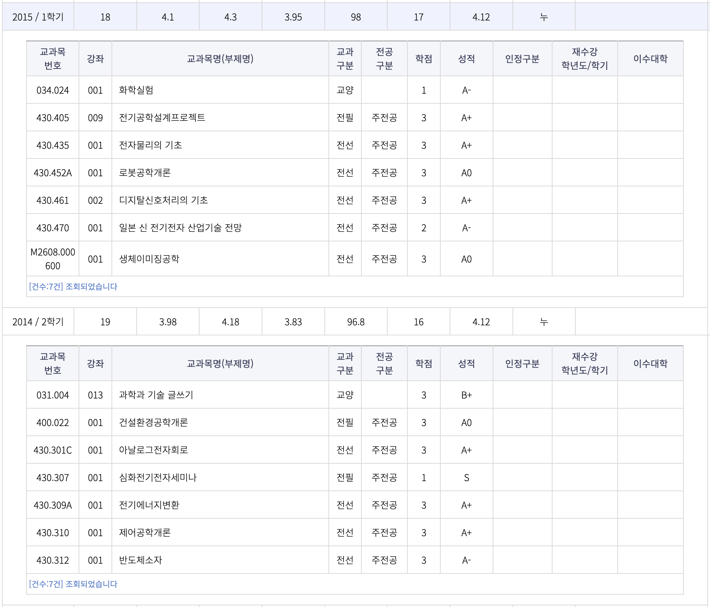

# 삶의 지도

글또에 지원하며 제 삶을 되돌아보고 인생의 지도를 그려볼 수 있는 소중한 기회를 얻은 것 같습니다. 이렇게 멋진 모임을 오랫동안 운영하고 계시는 글또 운영진 분들께 감사합니다.

# 원하는 목표를 달성해 본 어린 시절

어렸을 때는 공부에 큰 관심이 없었습니다. 부모님도 당시에는 교육에 대해서는 크게 관여를 안 하셨던 것 같습니다. 초등학생 때부터 바둑 학원만 보내주셨는데 정말 재미있어서 프로 바둑 기사를 해봐야겠다는 생각도 가졌습니다. 프로 바둑 기사분들의 기보들도 밤까지 모두 외워서 둘 정도로 열심히 했던 기억도 있습니다. 하지만 초단 승급 시험때 저보다 훨씬 잘 두는 분들을 만나고서 큰 벽을 느끼고 어린 마음에 이 길은 쉽지 않겠다는 생각과 함께 중학교에 진학했습니다.

중학교때에도 공부도 좋아하는 과목만 했었고 게임도 많이 했던 것 같습니다. 그리고 중학교 3학년 때 친구들이 외고나 과고를 준비하는걸 알게 되면서 이런 공부의 길도 있다는걸 조금 늦게 알게 되었습니다. 제가 기억하기로 외고 시험까지 몇 개월 남지 않았던 시점이었는데, 서점에 가서 영단어 책을 하나 사와서 이것만 외우고 시험보러 가야겠다고 생각했습니다. 그리고 시험전까지 영단어는 모두 암기했지만 정말 당연히도 외고 시험에 떨어지고 일반 고등학교에 진학하게 되었습니다.

그리고 당시 고등학교에서 우수 반으로 2개 반을 관리했었는데 운이 좋게도 마지막 우수 반에 들어갈 수 있었습니다. 하지만 첫 모의고사에서 뒤에서 네 번째 안에 들었던 것 같습니다. 하지만 그때 제 마음에 막연히 목표가 생겼습니다. **"나는 무조건 서울대를 간다."** 는 목표였습니다.

처음에는 주변에서 친구들의 조롱과 비난도 있었습니다. 너가 어떻게 지금 이 성적으로 갈 수 있겠냐고 하는 이야기들이었습니다. 하지만 저는 제 현실과 크게 떨어진 목표였음에도 그 목표를 주변에 이야기하는데 부끄러움은 없었습니다. 실제로 제 결심을 주변에 밝히니 그 목표에 대한 책임감이 생겼고 저절로 제 자신이 바뀌게 되었습니다. 그리고 고등학교 3년 동안 제가 만든 책임감과 함께 정말 치열하게 공부한 결과 원하는 목표를 달성할 수 있었습니다. 고등학교 어린 시절이었지만 운이 좋게도 작게나마 성공해본 경험을 하며 이때 배운 삶의 원칙은 지금까지도 많은 영향을 주고 있습니다.

**“내가 배울 수 있는 그룹에 들어가서 그 분위기를 업고 같이 성장하는 것.”
”머릿 속에 꿈을 말할 수 있는 용기만 있다면 원하는건 뭐든 이룰 수 있다는 것.”**

# 원하는 목표를 이루었지만 오히려 방황했던 시절

원하는 대학교에 진학해서 너무 행복했습니다. 하지만 그 행복은 오래 가지 못했습니다.

지금 생각해보면 제 목표 자체가 그 학교에 대한 입학이였기때문에 그 이후의 목표가 없었던 저는 길을 잃을 수 밖에 없었던 것 같습니다. 오히려 공대보다는 진로와 미래가 어느 정도 정해져있는 의대쪽이 좋았지 않았을까 싶었던 생각도 했던 것 같습니다. 지금 배우는 공부들이 도대체 나중에 어떻게 쓰일 수 있는지 알려주는 사람들도 없어서 힘들었습니다. 이런 고민들과 함께 3학년에 진학했고 전공 공부를 제대로 시작하는 시기가 되면서 다시 한 번 제 자신에 대해 도전 욕구가 불타올랐습니다. 1, 2학년때는 다른 친구들에 비해 조금은 뒤쳐졌지만 다시 한번 여기서도 제가 배운 내용이 통할지 시험해보고 싶었습니다. 그리고 다시 한번 더 도전을 했고 전공 과목이 제일 많았던 3학년 2학기와 4학년 1학기에 좋은 성적을 받아 반액/전액 장학금을 받을 수 있었습니다.

그리고 당시 신임 교수님의 세미나를 우연히 듣고 뇌 공학쪽에 관심이 생겼고, 뇌 영상 신호처리 대학원 연구실에 석박사 통합으로 진학을 하게 되었습니다

# 개발자를 시작하게 된 계기

지금 다시 생각해봐도 저에게 연구는 쉽지 않았던 것 같습니다. 정해진 답이 있는 문제를 해결하는 분야가 아니었기에 언제든 답은 안나올 수 있었습니다. 이런 과정이 반복되면서 내가 연구자로써 성공할 수 있을까 라는 생각과 함께 번아웃이 왔었습니다. 이때 SNUSV라는 창업동아리를 알게 되었고 바로 지원해 창업 프로젝트를 시작하게 되었습니다.

MVP도 개발할 수 있었고, 마지막에는 창업 선도 대학 프로그램에도 선정이 되었었지만 그 당시에 군대 문제도 있었고, 제 자신이 많이 부족하다는걸 느끼기도 했습니다. 당시 MVP를 개발할때 개발 관련 지식이 많이 필요했습니다. 하지만 개발을 모르니 외주 금액으로 상당한 부분이 나갔고, 외주로는 원하는 기한까지 원하는 결과물이 나오기가 정말 어렵다는 것을 배웠습니다.

그래서 이럴바에는 내가 개발을 배워서 해봐야겠다는 생각을 했고 나중에 창업을 할때도 큰 도움이 될 것 같다는 생각을 하며 개발자로 직무를 바꿔야겠다는 결심을 했습니다. 그리고 박사 진학을 포기한다고 교수님께 말씀드리고 석사 졸업 후에 병특을 할 수 있는 개발 회사로 지원하며 새로운 출발을 하게 되었습니다.

# 개발자를 향한 도전

전공 지식이 전무한 상태에서 컴퓨터 공학부를 졸업한 친구들과 경쟁하는게 쉽지는 않았습니다. 그래서 업무를 하면서 회의를 하면서 나오는 모르는 내용은 뭐든 물어보고 제 것으로 만들려고 노력했습니다. 그리고 제 모든 질문에 같이 고민하고 방법과 답을 알려주셨던 좋은 사수 분들과 동료 분들이 계셔서 개발자로 많이 성장할 수 있었습니다.

저는 이때 제 삶의 원칙을 하나 더 배울 수 있었습니다.

**"질문을 하는 사람은 잠시 동안 바보가 되고, 질문하지 않는 사람은 평생 바보가 된다."**

# 스타트업을 향한 도전

중견기업과 대기업의 개발 회사를 다니면서 개발자로 성장하고 있다는 만족감은 있었지만 창업에 대한 갈증은 항상 있었습니다. 그리고 실제로 그 다음 회사로 대기업에 다녀보니 모든 업무 프로세스와 시스템이 구축 되어있고, 자신의 직무안에서 크게 벗어나지 않고 일할 수 있는 삶이라는 것을 느낄 수 있었습니다. 물론 대기업에서도 주도적으로 일 할 수 있었지만 그 한계가 분명하게 있다는 것을 느꼈고, 제가 이 회사에 크게 기여할 수 있는 부분이 없다고 느꼈던 것 같습니다.

그런 고민끝에 제가 더 주도적으로 일 할 수 있는 스타트업에 가고 싶다는 생각을 하게 되었고, 마침 현재 회사의 CEO분과 커피챗을 하면서 여기 회사라면 내가 주도적으로 일 할 수 있겠다는 생각이 들었습니다. 그리고 원래도 창업에 관심이 있었기에, 여기에서 스타트업의 폭발적인 성장을 같이 해보는 중요한 경험을 가져가야겠다고 생각했습니다. 당시 회사는 시리즈 A 투자를 마친 상태였고, 이제 막 제품화가 진행된 제품으로 데모 1호 고객을 유치하던 시점이었습니다.

제품 적으로 스케일 업 할 수 있는 전략들에 대해 많이 고민했고, 처음에는 고객 만족을 최우선으로 생각했습니다. 제품에 문제가 있다고 CS팀에 요청이 있으면 바로 병원으로 달려가 원인 파악을 했고 바로 해결하려고 노력했습니다. 그리고 제품이 어느 정도 팔리기 시작하면서는 개발자들이 일하는 방식에 대해 고민을 많이 했습니다. 어떻게 일할 때 개발자들이 효율적으로 일 할 수 있을지, 제가 전에 회사들에서 겪으며 힘들고 불편했던 부분들은 여기서 모두 해결해보자는 생각을 많이 하고 있습니다.

제가 선택한 스타트업에서 주도적으로 일하는 삶은 지금 너무 재미있고 행복합니다.

이때 추가한 제 삶의 원칙은 다음과 같습니다.

**"나는 주도적으로 일 할 수 있는 환경에서 더 행복하게 일 할 수 있다."**

# **글을 쓰고 싶은 이유**

최근 인프런 CTO로 계신 이동욱님의 “혼란함에 익숙해지기” 발표를 듣게 되었습니다.

동욱님은 성공하는 스타트업은 폭발적인 성장이 필수적이고, 그에따라 어쩔 수 없이 혼란함이 있다고 이야기를 해주셨습니다. 배달의 민족에서 개발팀에 있었던 경험을 이야기를 많이 해주셨는데 정말 제가 들어도 혼란함 그 자체였습니다. 하지만 그럼에도 불구하고 우아한 형제에서 잘 했던건 “혼란함 속에서도 핵심을 놓치지 않는 것” 이였고, 그래서 10년만에 M&A 시점 7.9조의 기업으로 성장할 수 있었던게 아닐까 말해주셨습니다.

그래서 저 또한 혼란함 속에서도 핵심을 놓치지 않기 위해 지금 스타트업에서 경험하며 배운 소중한 교훈들을 시간이 있을때마다 모두 글로 남겨보고 싶습니다.

글또의 **삶의 지도** 덕분에 다시 제 인생들 돌아보며 내가 이런 사람이였구나를 알아갈 수 있었던 시간이었습니다.

**“내가 배울 수 있는 그룹에 들어가서 그 분위기를 업고 같이 성장하는 것."**
**"머릿 속에 꿈을 말할 수 있는 용기만 있다면 원하는건 뭐든 이룰 수 있다는 것."**
**"질문을 하는 사람은 잠시 동안 바보가 되고, 질문하지 않는 사람은 평생 바보가 된다."**
**"나는 주도적으로 일 할 수 있는 환경에서 더 행복하게 일 할 수 있다."**

글또에 합격하게 된다면 제가 작성한 **삶의 지도**에 있는 제가 배운 **삶의 원칙**들을 다시 생각해보며 지금의 마음을 잊지 않고 실천하도록 하겠습니다.

감사합니다!
