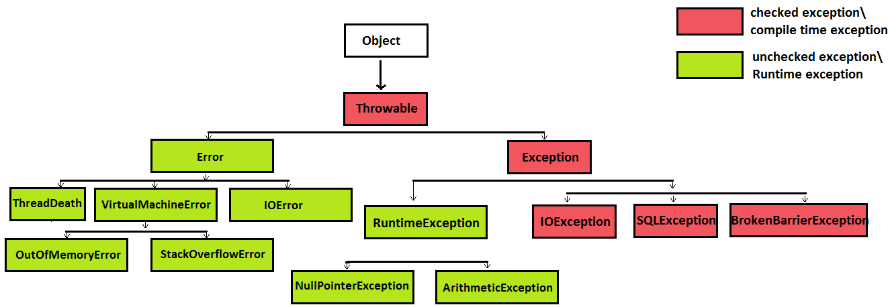

# 🚀 Java Exception 종류

Java에서는 exception의 종류가 크게 2가지로 나뉘게 되는데, 바로 checked exception과 unchecked exception이다.

<출처: [https://www.javamadesoeasy.com/2015/05/exception-handling-exception-hierarchy.html](https://www.javamadesoeasy.com/2015/05/exception-handling-exception-hierarchy.html)>

## 🔥 checked exception
checked exception은 컴파일 타임 때 체크되는 exception으로 개발자가 이에 대해 명시적으로 표현을 해주어야 한다.

1. checked exceoption이 생기는 메소드를 사용하는 메소드에 throws 키워드를 붙인다.

2. checked exception이 생기는 메소드를 try-catch 블록을 사용해 예외 처리를 해준다.

## 🔥 un-checked exception
unchecked exception은 런타임에 생길 수 있는 exception들로 compile time에 체크하지 않는다. unchecked exception의 종류들로는 다음과 같다.
* NullPointerException
* ArrayIndexOutOfBoundsException
* ArithmeticException
* IllegalArgumentException
* NumberFormatException

위와 같은 예외들은 try-catch로 해결하기 보다는 프로그래머가 주의 깊게 코드를 짜서 예외가 생기지 않도록 하는게 맞는 방향이라고 한다.

## 📝 사용해보며
Spring에서 제공해주는 @ResponseStatus Annotation을 직접 만든 exception class에 추가 해주고, 이 exception을 특정 상황에 throw를 해주면 @ResponseStatus Annotation value로 넣어준 status code로 http response가 client에게 보내진다.

>Note, that when we mark an Exception class with @ResponseStatus, Spring always calls HttpServletResponse.sendError(), whether we set reason or not.
> **from [https://www.baeldung.com/spring-response-status](https://www.baeldung.com/spring-response-status)**

나는 ResourceNotFound라는 Exception을 만들어서, jpa를 통해 find를 하는 코드에서 에러가 날 경우 위의 에러를 던지도록 만들었다. 그리고 사용을 하다보니 forEach나 stream안에서 사용을 하는 경우가 생겼는데, 내가 만든 Exception을 Exception Class를 상속받아 만들었어서 checked exception으로 처리되어 무조건 try-catch 블록으로 감싸야 하는 문제가 생기게 되었다. exception을 던져야 하는데.. try-catch로 잡고, 다시 이 exception을 던져야 하는 상황이였는데, 코드도 이상하고, 뭔가 이상하다고 생각을 했는데 exception을 공부해보니 내가 만든 Exception은 RuntimeException으로 만들어야 한다는 것을 알게 되었다. 다시 class도 RuntimeException을 상속받아 만들어서, 컴파일 타임때 문제가 생기지도 않고 상황상 논리적인 흐름으로 코드를 짤 수 있었다.