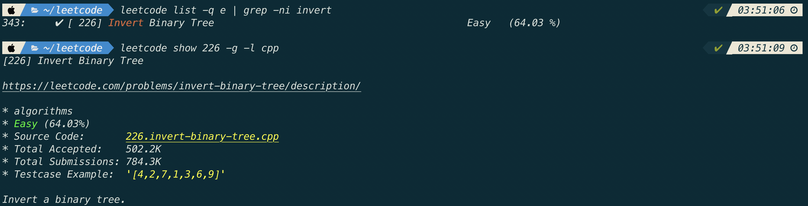
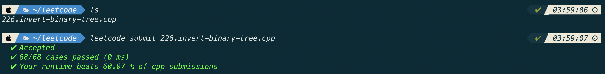

종종 leetcode에서 알고리즘 문제를 푸는데 항상 내 vim 환경에서 문제를 풀면 좋겠다라는 생각을 했었다.

leetcode에서도 vim환경을 제공해주지만 custom한 key mapping은 아직 지원을 해주지 않고 (예를 들면 jk esc mapping) 또, 많이 사용하는 vim plugin(nerdcommenter, surroundvim 등등)도 사용하지 못하기 때문에 내 컴퓨터로 가져와서 내 환경에서 문제를 풀고 업로드하고 싶다는 생각을 했었다.

역시나 찾아보니 leetcode-cli라고 하는 유틸리티가 있고 생각보다 너무 잘되어 있어서 설치 방법과 사용 방법을 공유하기 위해 올린다.

- [leetcode-cli github 주소](https://github.com/skygragon/leetcode-cli)

# leetcode 설치


$ npm install -g leetcode-cli
$ leetcode version


# leetcode 로그인


$ leetcode user -l


위의 명령어를 치면 id와 pass를 입력받는다.

하지만 id와 pass를 입력해도 로그인이 되지 않는데,

아래의 글을 참고했다.

[https://github.com/skygragon/leetcode-cli/issues/153](https://github.com/skygragon/leetcode-cli/issues/153)


$ leetcode plugin -i cookie.chrome


leetcode-cli에서 제공하는 여러 플러그인이 있는데, 위의 플러그인을 설치하고
다시 로그인을 하니 잘 되었다.

위의 cookie.chrome 플러그인에 대한 설명을 읽어보니
Leetcode.com에서는 한 유저에 대해 하나의 session만 유지한다고 한다.
따라서 위의 plugin을 설치해서 크롬으로 로그인한 session을 leetcode-cli에서도 이용해
한 유저에 대해 세션이 2개가 생겨 문제가 되었던 것이 위의 플러그인으로 해결이 된 것 같다.

# leetcode 내 개발 환경에서 풀기

# leetcode 제출하기

# leetcode-cli 사용 후기
확실히 나에게 맞는 개발환경에서 문제를 푸니 느낌적으로 2배는 잘 풀리는 느낌을 받는다.
그리고 저장할 때 마다 자동 indent가 되는 clang-format vim plugin을 사용하고 있는데
알고리즘 풀 때, indent를 신경쓰지 않고 풀 수 있어서 이것도 큰 장점인 것 같다.