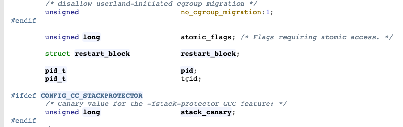

# 프로세스와 스레드의 차이

linux에서 process와 thread의 차이에 대해 한번 정리해보려고 한다.

## 🔥 프로세스

프로세스는 linux 커널의 스케줄 대상으로써, 프로그램(binary 파일)이 메모리에 실제로 올라가 실행되고 있는

하나의 실행 흐름이라고 할 수 있다.

프로세스는 메모리에 올라가면 다음과 같은 메모리 구조를 가지게 된다.

stack, heap, data(+bss), code

그리고 kernel에서는 이 프로세스를 관리하기 위해 Process Control Block이라는 자료구조를 이용해 관리하고,

Process Control Block에는 다음의 정보를 저장해 관리한다.

- Process ID
- Process State
  - enum proc_state {UNUSED, EMBRYO, SLEEPING, RUNNABLE, RUNNING, ZOMBIE}
- Program Counter (eip in register)
- I/O status information
- 레지스터 (context 자료구조)
  - struct context {
      int eip;
      int esp;
      int ebx;
      int ecx;
      int edx;
      int esi;
      int edi;
      int ebp;
  }
- 등등

## 🔥 프로세스

스레드는 프로세스가 여러 작업을 동시에 하기위해 고안된 작업 흐름 개념이다.

스레드는 프로세스안에서 열려있는 파일 리스트, 파일 디스크립터, 환경변수, heap, data, code영역을 공유하고

stack, process state, register, program counter(ip)를 따로 가지고 있다.

스레드라는 개념은 프로세스 이후에 나온 개념으로, linux에서는 light weight process라는 개념으로 사용이 된다.

linux에서는 window와 다르게 process와 thread모두 task_struct라는 같은 자료구조를 이용해 관리하게 된다.
(linux에서는 task_struct가 pcb로 쓰인다)

그리고 여기서 신기한 점이 getpid 시스템 콜과 gettid 시스템 콜을 할 때, return되는 값을 유심히 봐야한다.

task_struct의 자료구조 안의 해당 멤버변수를 아래와 같이 return한다.

getpid() -> return tgid;
gettid() -> return pid;

다시 한번, linux에서는 모든 것들을 process로 관리한다는 말을 느낄 수 있다.

여기서 위의 두 값을 비교해서 현재 메인 스레드가 누구인지를 확인할 수 있는데,
이전에 했었던 작업 중에 main thread에서만 event queue에 task를 로딩하도록 강제되어 있는 library를 사용했어야 했는데 뜯어보니 내부 로직에서 main thread여부를 이것으로 판단하는 로직이 있었던 기억이 있다.

## ➕ 멀티 프로세스와 멀티 스레드 프로그래밍의 차이점

멀티 프로세스들이 자원을 공유하기 위해서는, 또는 데이터를 주고 받기 위해서는 shared memory를 이용하거나 IPC를 이용해야한다. 이건 커널의 도움을 받아야하는 작업이기 때문에 오버헤드가 있을 수 있다.
하지만 멀티 프로세스중 하나의 프로세스가 메모리에 잘못 접근해 sigfault를 받더라도 다른 프로세스들에 영향을 주지 않는 장점이 있다.

멀티 스레드는 한 프로세스안에서 자원을 공유하기 때문에 커널의 도움을 받을 필요가 없어 멀티 프로세스보다는 오버헤드가 적다. 하지만 하나의 스레드라도 메모리에 잘못 접근한다면 프로세스가 죽을 수 있고, 이로 인해 전체 스레드가 모두 위험해지는 문제가 있다는 단점이 있다.

또 요즘 추세는 cpu core가 많아지므로, 멀티 프로세싱은 필수적인 사항이다. 멀티 프로세스와 멀티 스레드를 적절히 모두 잘 사용해서 좋은 구조를 이용하는게 좋을 것 같다. 😄