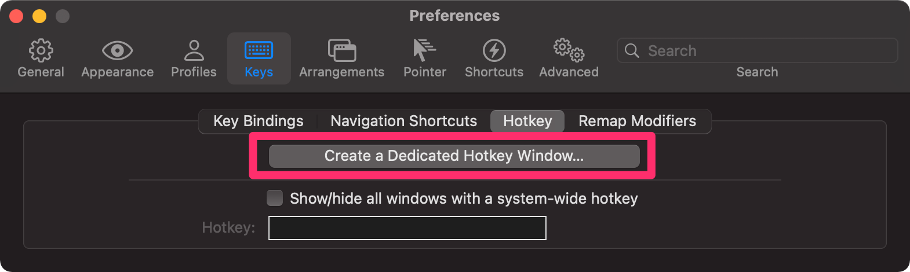

iterm 세팅할때 hotkey window를 설정해주면 개발할때 편하다.

그런데 hotkey window를 사용할때 alfred clipboard 기능을 이용하는데 clipboard를 열때마다 hotkey window가 뒤에 가만히 있지 않고 hide되어서 붙여넣기를 할 수 없었다..

iterm 에서 아래의 설정을 켜주면 이제 alfred가 켜져서 active되지 않더라도 사라지지 않는다.

추가적으로 hotkey window에서 vim의 컬러 테마를 정하고 켜게되면 hotkey window의 transparent 속성이 적용되지 않는데, 아래 설정을 꺼주면 vim에서도 transparent한 window를 그대로 적용 가능하다.

