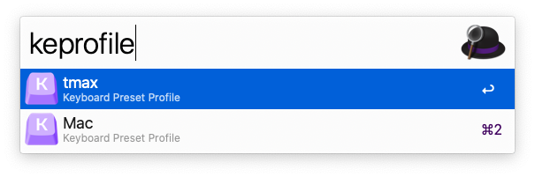

최근에는 회사에서도 개인 맥북으로 작업을 하고 있다.

회사 키보드는 맥 전용 키보드가 아니라서 command <-> opt을 바꿔줘야 맥북 키보드와 같은 기능을 한다.

그래서 매번 맥북을 회사 키보드에 연결하면 karabiner를 열어 profile을 변경해줘야하는데 여간 귀찮은 일이 아니다.

이 문제 역시 구글링을 해보니 Karabiner Element Profile Switcher라는 alfred가 제공해주는 tool을 이용해 해결이 가능했다.

https://www.alfredforum.com/topic/9927-karabiner-elements-profile-switcher/

잘 되지 않는다.

https://www.alfredapp.com/help/troubleshooting/incompatible-python-workflow-library/

위에서 fix python workflow를 통해 다시 정상 작동되었다.

# 더 나은 해결 방법

맥북에 연결하는 키보드 별로 단축키를 바꾸고 싶다면 위보다 더 좋은 방법이 있었다.

위처럼 target device로 해당 키보드를 선택하고 키보드 키 설정을 해주면, 맥북에 키보드가 연결될 때 자동으로 설정된 키를 따르게 된다.

굳이 cmd + space를 눌러서 keprofile을 치면서 profile을 바꿀 필요가 없다.

위의 경우는 정말 계정별로 다른 설정들이 필요할 때 사용하면 좋을 것 같다.