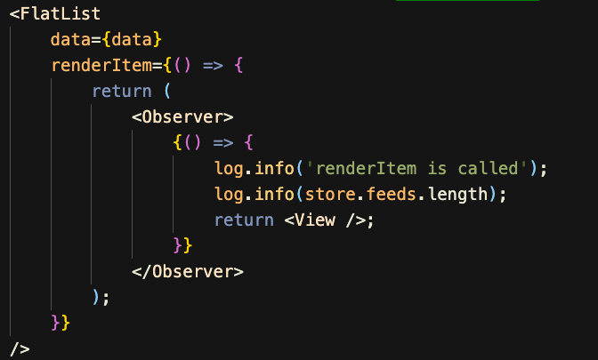
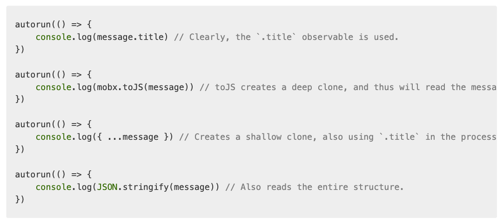

# React FlatList does not react to mobx observable data

mobx에서 observable array를 FlatList의 data로 연결하고, useEffect에서 특정 트리거 조건에서만 observable array에 추가 엔트리를 push하는 상황이였다. 아무리 push를 해도 작동하지 않았는데, 아예 reference를 바꾸면 동작을 했다. 하지만 이거는 내가 원하는 내용은 아니였기 때문에 나와 같은 사람들이 있는지 찾아보았다.

크게 간과하기 쉬운 문제로 2가지가 있었다. 이 부분만 제대로 사용하면 mobx를 사용하는데 굉장히 큰 도움이 될 것 같다.

## 1) renderItem callback ```<Observer></Observer>```로 감싸기



FlatList renderItem과 같이 callback function을 필요로 하는 컴포넌트들이 있다. 해당 FlatList를 렌더링하는 컴포넌트(물론 mobx의 observer로 감싸서 구독 신청을 한 컴포넌트)안에서 store의 observable 변수를 dot operation을 이용해 사용하면 당연히 해당 observable 변수가 바뀌었을 때 구독 신청한 컴포넌트가 불린다. 하지만 구독 신청한 컴포넌트가 렌더링하는 다른 컴포넌트의 renderItem과 같은 콜백 부분에 mobx store의 observable 변수들을 사용한다고 구독 신청한 컴포넌트가 새로 불리지는 않는다. 코드적으로는 구독 신청한 컴포넌트의 render 파트의 코드에 있으니까 당연히 컴포넌트가 불려야한다고 생각할 수 있지만, renderItem과 같은 callback은 이미 구독 신청한 컴포넌트의 life cycle과는 별개가 되어버렸기 때문에 위와 같이 구독 추가 작업을 해주어야 한다.

## 2) FlatList data에 observable array slice해서 넣기

[https://dev.to/acro5piano/to-pass-mobxs-observable-array-to-flatlist-slice-is-needed-2b45](https://dev.to/acro5piano/to-pass-mobxs-observable-array-to-flatlist-slice-is-needed-2b45)

위의 글이나 mobx에 질문들로 올라온 이슈들을 보면 굉장히 빈번하게 겪는 문제인 것을 알 수 있다.

하지만 지금 내가 설명하려고 하는 부분과는 설명이 조금 다른 부분이 있다.

왜 FlatList의 data prop에 observable array를 넣었을 때, action에서 해당 observable array에 item을 push했을때, 동작하게 하려면 어떻게 해야할까?

절대 아래와 같이 하면 절대 반응하지 않는다.


    <FlatList
        data={store.feeds}
        initialNumToRender={4}
        keyExtractor={(feed) => {
            return feed.id;
        }}
        ...
    />


좀 더 mobx의 근본적인 코드 예시를 보면 더 쉽게 이해할 수 있다.

실제로 autorun 안에서 observable array를 접근이 아니라 단순히 사용했을 때, observable array에 push를 한다고 해서 작동하지 않는다.


import { autorun, observable, makeAutoObservable } from 'mobx'

class Message {
    title
    author
    likes
    constructor(title, author, likes) {
        makeAutoObservable(this, {likes: observable.shallow})
        this.title = title
        this.author = author
        this.likes = likes
    }

    updateTitle(title) {
        this.title = title
    }

    pushLikes(item) {
        this.likes.push(item);
    }
}

let message = new Message("Foo", { name: "Michel" }, ["Joe", "Sara"])

autorun(() => {
    console.log(message.title)
})

autorun(() => {
    // is called
    console.log(message.likes.slice())
    // is called
    message.likes.map((item)=>{
        console.log(item);
    })
    // is not called
    console.log(message.likes);
})

message.pushLikes("Taehyun");


mobx docs의 아래 내용과 관련이 있는데 실제로 "dotting into"하는 작업이 있어야 한다. (3 번째 케이스 처럼 암묵적으로도 가능하다.)
[https://mobx.js.org/understanding-reactivity.html](https://mobx.js.org/understanding-reactivity.html) 참고


따라서 FlatList에서 observable array를 넣어줘야 할때는 slice를 해주어야 반응하게 된다.

추가적으로 재미있는건 observable array가 ref로 구독 신청이 되어있다면, 구독 신청 컴포넌트에서 .length같은 dot operation을 사용하더라도 observerble array에 아이템이 추가로 push되었을 때 불리지 않는다. 어차피 넌 ref 여부만 볼거니까 length dot operation을 쓴 구독 컴포넌트를 불러주지 않는다. 하지만 shallow나 deep 구독으로 바꾸면 불러준다.