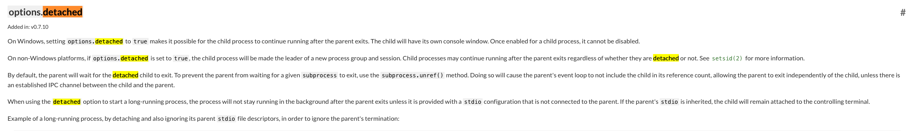
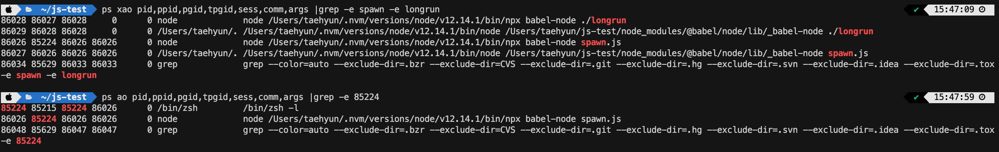
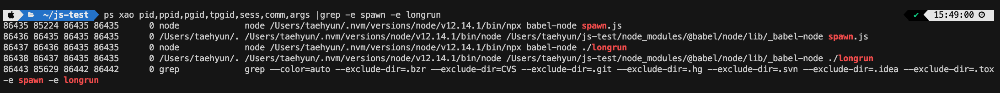

node의 내장 모듈인 `child_process`를 공부하다가 spawn과 fork에서 주는 option중에 detached를 보게 되었다.

[node 공식문서: child_process](https://nodejs.org/api/child_process.html)

윈도우가 아닌 플랫폼(mac, ubuntu.. )에서는 자식 프로세스가 새로운 프로세스 그룹과 세션의 리더가 될 수 있는 옵션이라고 설명이 되어 있다.

이 옵션이 쓰이는 경우가 언제일지 생각해 봤고(자식이 새로운 프로세스 그룹과 세션의 리더가 되면서 생기는 이점이 언제일까?) 혼자 삽질 끝에 납득할만한 이유를 알아냈다. (stack overflow에서도 이 옵션이 정확히 언제 쓰이는지에 대한 내용은 잘 나와있지 않았다 ㅠ)

부모가 속한 process group에서 이탈하면서 생기는 이점은 단순히 부모가 속한 프로세스 그룹으로 날라오는 시그널로부터 독립적이라는 장점밖에 없다. 그런데 node 공식문서의 detached option 쪽을 계속 다시 읽어보다가 background와 관련된 내용이 나와서 detached option이 background 프로세스와 관련이 있는 것인지 찾아보다가 다음과 같은 글을 보게 되었다.

[http://www.andy-pearce.com/blog/posts/2013/Aug/process-groups-and-sessions/](http://www.andy-pearce.com/blog/posts/2013/Aug/process-groups-and-sessions/)

background 프로세스와 foreground 프로세스의 차이는 user와 상호작용을 할 수 있는 controlling terminal을 session에서 가지는지에 대한 여부이며, controlling terminal을 가질 경우 tpgid(foreground process group id)를 가지게 된다. (없을 경우 -1 in linux)
여기서 session을 이탈할 경우 (새로운 session 리더가 될 경우) 원래 session의 controlling terminal로부터 떨어져 나가게 되면서 background process가 될 수 있는 자격을 얻게 된다.

여담으로 현재 터미널 bash에서 쉘 프로그램을 실행시키면, 그 쉘 프로그램은 터미널의 tpgid를 그대로 물려받아 터미널에서 실행되는 bash와 같은 tpgid를 받고, 이 쉘 프로그램의 pid는 bash의 tpgid와 같은 값을 가지면서 bash 입장에서 foreground가 되는 것이다. 터미널에서 ctrl-c를 눌러 sigint를 날리면 sigint를 bash가 속한 process group으로 날리지 않고, terminal이 이것을 해석해서 bash와 같은 tpgid를 가진 프로세스들(foreground 프로세스들)에게 시그널을 날려 프로세스를 종료시킨다. (bash의 foreground process들에게 시그널을 날린다.)

실제로 node에서 spawn을 이용해 detached:true 옵션을 주고 child process를 새로 만든다면, 부모 프로세스의 pgid뿐만 아니라 tpgid 또한 자식에서 달라지는 것을 알 수 있다.

* babel-node를 써서 조금 헷갈리지만 (babel-node로 js파일을 실행하면 babel-node가 node로 js파일을 새로 띄운다. babel-node(parent) <-> node(child)) 4번째가 1번째의 부모 프로세스다.
* babel-node spawn.js를 실행시킨 zsh의 pid는 85224이며, tpgid는 86026이다. spawn.js에서 detached: true를 주고 spawn한 longrun.js를 실행하는 node 프로세스의 pgid와 tpgid가 바뀐것을 알 수 있다.
* babel-node spawn.js를 실행시켰던 zsh의 tpgid(foreground pgid)가 babel-node spawn.js 프로세스의 pid가 되었다.
- **OSX에서 session id가 ps 명령어로는 제대로 볼 수 없다고 한다. 그래서 위처럼 process session id가 모두 0으로 보임 [https://stackoverflow.com/questions/35248294/does-os-x-support-posix-sessions](https://stackoverflow.com/questions/35248294/does-os-x-support-posix-sessions)**

node에서 spawn을 이용해 detached:false 옵션을 주고 child process를 새로 만든다면, 자식 프로세스의 pgid와 tpgid가 부모 프로세스의 pgid와 tpgid랑 같은 것을 알 수 있다. sid도 같을 것이다.

결국 detached: true 옵션을 주어서 child process를 생성하는 상황은 child process를 background로 돌릴 때 사용하는 옵션이라는 것을 알 수 있었다. 여기서 완전하게 background 프로세스로 만들기 위해([위의 블로그에서 말하는 표준적인 background 프로세스 만들기 과정 참고](http://www.andy-pearce.com/blog/posts/2013/Aug/process-groups-and-sessions/)) 몇가지 작업을 더 해줄 수 있다. child_process의 unref함수를 사용하면 parent는 child를 wait하지 않는다. (child process의 pid는 이때 당연하게도 init process(pid=1)가 된다.) 여기에 stdio를 모두 ignore로 주게 되면 parent process의 stdio를 전부 무시한다. Daemon에게 필요 없는 스탠다드 파일 디스크립터들을 물린다는 것은 자원의 낭비며, 행여 모를 오류의 원인이 된다. 이렇게 세팅을 해줌으로써 parent와 독립적인 background 프로세스가 될 수 있게 된다.
