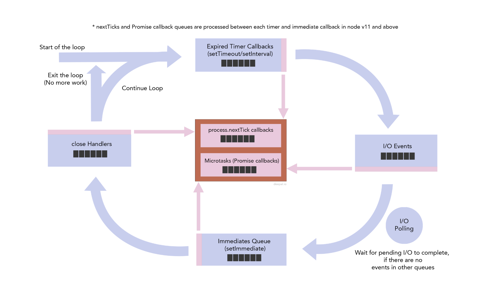

# 💡 Node는 single thread event loop

Node는 main thread에서 call stack을 처리하고, call stack을 전부 처리하면 event loop(libuv의 구현체) event queue에 적재되어 있는 event 콜백들을 모두 처리한다.

콜 스택 처리부터 콜백 처리까지 모두 하나의 스레드에서 처리되기 때문에 보통 일반적으로 많이들 "Node는 single thread event loop 이네!"라고 하지만 여기서 Node를 처음 접하는 사람들은 오해하기 쉬울 것 같다.

I/O 작업과 같이 기본적으로 오랫동안 block 될 수 있는 작업을 실행 흐름이 하나인 (single thread) Node가 실행하게 되면 서버가 멈추게 된다. 따라서 Node는 I/O작업들을 async하게 처리하고, thread pool의 thread에 이런 일들을 위임함으로써 이 문제를 해결했다. 여기서 이미 single thread가 아니라고 할 수 있다.

더 정확하게 말하면 "Node는 하나의 프로세스이며, main event loop이 single thread 위에서 돌고 I/O operation들은 별도의 다른 스레드에서 처리 되는 구조" 라는 표현이 좋을 것 같다. 그리고 event loop은 event queue에 적재되어 있는 callback들을 main thread의 stack이 모두 빌 때, 우선 순위에 맞게 처리하는 구조인 것이다.

여기서 event queue에 적재되어 있는 callback에 우선순위가 있다는 표현이 중요하다.

실제로 event loop이 동작하는 과정은 여러개의 큐를 복합적으로 사용하는 복잡한 과정이다.

아래는 Node 공식 문서의 내용이며, 이 내용을 너무 잘 표현한 그림이 있는 블로그 주소도 아래에 같이 링크를 달아놓았다.

[https://nodejs.org/en/docs/guides/event-loop-timers-and-nexttick/#the-node-js-event-loop-timers-and-process-nexttick](https://nodejs.org/en/docs/guides/event-loop-timers-and-nexttick/#the-node-js-event-loop-timers-and-process-nexttick)

위의 [블로그 링크](https://blog.insiderattack.net/timers-immediates-and-process-nexttick-nodejs-event-loop-part-2-2c53fd511bb3)에서 가져온 그림으로, 위의 설명을 굉장히 잘 표현한 그림인 것 같다.

## 🔥 Node's 6 Phases

Node의 event loop은 크게 6가지의 phase를 돌게 된다. 공식문서에 설명되어 있는 phase는 아래와 같이 총 6개가 있다.

위의 Phase를 event loop이 순차적으로 돌면서 각각의 queue에 적재된 event callback을 모두 처리한다.

1⃣  timer phase에서 timer queue (정말 많이 쓰고 봤던 setTimeout 콜백이 여기에 적재된다.)를 처리한다.

2⃣  pending callbacks phase에서 다음 iteration으로 연기된 I/O callback event를 처리한다.

3⃣ Idle/prepare phase는 별다른 설명이 없고, 내부적으로만 쓰이는 phase이기 때문에 node를 사용하는 사용자 입장에서 크게 신경쓰지 않아도 될 것 같다.

4⃣ 다음으로 poll phase에서 fs의 read, write 등등 I/O callback을 처리한다.

5⃣ chek phase에서 setImmediate 콜백을 처리하고,

6⃣ 다음으로 close callback에서 종료 callback (e.g. socket.on('close', ...)) 을 처리한다.

그런데 여기서 정말 중요한 점이 Node의 stack이 다 풀리는 시점과 Phase 사이사이에 확인을 하는 가상의 phase가 하나 더 존재한다.

바로 "next tick queue", "micro task queue"이다.

## 🔥 Next Tick Queue, Micro Task Queue

next tick queue에 적재되는 event callback들은 Node의 글로벌 객체인 process의 nextTick함수를 통해 추가할 수 있다. 그리고 micro task queue에는 우리가 잘 알고 있는 Promise 콜백함수가 올라가게 된다. 여기서도 우선 순위가 있는데 "next tick queue"가 "micro task queue"보다 우선순위가 높아 "next tick queue"의 콜백을 모두 처리하고, "micro task queue" 콜백을 처리한다.

결과적으로 Node의 스택이 풀리고, event loop이 처리하는 event callback queue들의 순서는 다음과 같다.

1⃣ next tick queue, micro task queue
2⃣ timer queue
3⃣ next tick queue, micro task queue
4⃣ pending callback queue
5⃣ next tick queue, micro task queue
6⃣ idle/prepare queue
7⃣ next tick queue, micro task queue
8⃣ poll queue
9⃣ next tick queue, micro task queue
1⃣0⃣ immediate queue
1⃣1⃣ next tick queue, micro task queue
1⃣2⃣ close callback queue
1⃣3⃣ next tick queue, micro task queue

이제 정말 마지막으로 하나만 더 정리하면 된다.

##🔥 New Chages to the Timers and Microtasks in Node v11.0.0

Node v10까지는 위와 같은 방식이였지만, Browser는 다른 방식으로 동작해서 사람들이 왜 event queue callback 처리 순서가 Node와 브라우저가 다른지 계속 문의를 했었다고 한다.

Node v10의 경우 timer callback에서 등록된 next tick callback과 promise callback을 timer callback queue가 모두 끝나고, 다음에 next tick queue와 promise queue를 확인할 때 처리를 했었는데, 브라우저는 timer callback에서 등록된 next tick callback과 promise callback을 timer callback 하나하나가 끝나고 바로바로 처리를 하게끔 구현이 되어있었다.

따라서 이 문제를 해결했었어야 했는데 (아무래도 같은 JS 런타임끼리는 같은 동작원리로 돌아가면 좋으니까?) Node v11부터는 브라우저와 같이 처리되도록 바뀌었다고 한다.

[New Changes to the Timers and Microtasks in Node v11.0.0](https://blog.insiderattack.net/new-changes-to-timers-and-microtasks-from-node-v11-0-0-and-above-68d112743eb3)