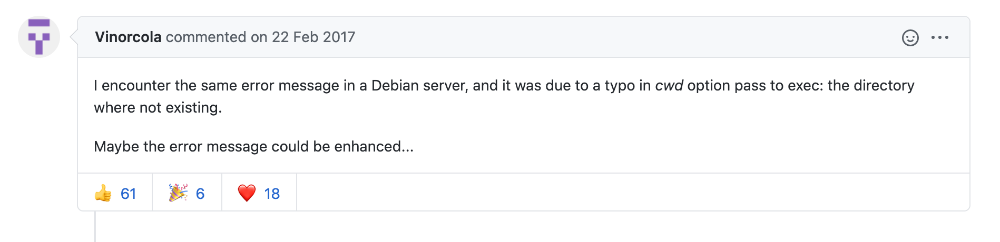

# ❎ 에러 발생

child_process의 spawnSync 함수를 쓰던 중 다음과 같은 에러를 보게 되었다.


> Error: spawnSync /bin/sh ENOENT


에러문만 보고는 왜 그런지 알 수 없었지만 구글링을 하고 나와 같은 에러가 있는 글을 보게 되었다.

[ https://github.com/nodejs/node/issues/9644 ](https://github.com/nodejs/node/issues/9644)

# 🌟 해결

spawnSync 함수에 주는 options의 cwd 경로가 잘못되어 문제가 발생했다. 그제서야 왜 shell로 실행시킬 entry가 없다고 했었는지 에러문을 이해할 수 있었다. 하지만 이 분 말 처럼 에러 메시지를 좀 더 명확하게 해줬으면 좋지 않았을가 라는 생각을 했다. (사람 마음은 다 똑같은 것 같다.. ㅋㅋㅋ)

> 
