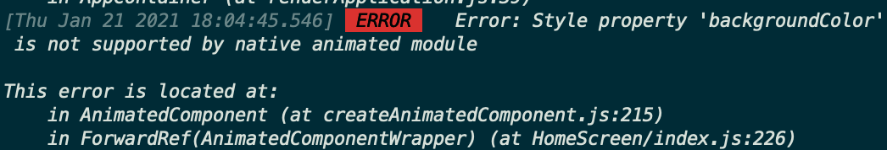

# ❎ 에러 발생

react-native에서 제공하는 Animated를 이용해 배경색을 바꾸는 애니메이션을 적용했는데, frame이 drop이 되어 애니메이션이 버벅이는 현상이 있었다. 그래서 react-native의 Animated가 제공하는 useNativeDriver: true 옵션을 주었는데 해당 에러가 발생했다.

# 🌟 해결

찾아보니 react-native에서 제공하는 Animated는 기본적으로 JS thread가 animation의 layout정보를 만들어서 UI thread에 요청하는 방식이였다. 하지만 JS thread가 re-render를 많이 해야하거나 네트워크 요청이 길어져서 UI thread에 애니메이션을 그리라는 요청을 frame rate에 맞게 제대로 보내지 않으면 frame이 drop되어 버벅이는 것처럼 보인다. 그래서 useNativeDriver라는 옵션을 true로 주어서 위처럼 작동하지 않고, 애니메이션이 UI thread에서만 작동하게해 위의 문제를 해결하려고 한 것 같다. 하지만 layout의 width나 height, color등의 애니메이션에 대해서는 native driver를 지원하지 않았고, 따라서 위와 같이 에러가 생긴 것이다.

[https://github.com/facebook/react-native/issues/14178](https://github.com/facebook/react-native/issues/14178) 참고

해결 방법은 react-native-reanimated 라이브러리를 사용하는 것이다. 위의 react-native가 제공하는 animation의 태생적인 한계때문에 react-native-reanimated는 모든 애니메이션이 UI Thread에 돌아가게 함으로써 해당 문제를 해결한다고 한다.

기초적인 구현만 해보았지만 기본적인 사용법은 기존의 Animated와 유사한 것 같다.

[https://medium.com/mj-studio/new-reanimated-v2-shines-react-native-animation-%EF%B8%8F-37e117ab652e](https://medium.com/mj-studio/new-reanimated-v2-shines-react-native-animation-%EF%B8%8F-37e117ab652e) 참고
