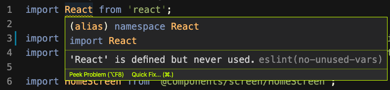

# ❎ 에러 발생

eslint를 사용하면서 react 관련 컴포넌트들이 사용이 됐음에도 불구하고, 사용되지 않았다는 에러가 생기는데 저 빨간줄을 없애야겠다는 생각이 들었다.

# 🌟 해결

eslint-plugin-react 모듈을 설치하고, .eslintrc.json 파일에 "plugin:react/recommended" preset을 extends하면 더 이상 해당 문구가 뜨지 않는다.


$ yarn add eslint-plugin-react -D



  "extends": [
    ...
    "plugin:react/recommended"
    ...
  ]

