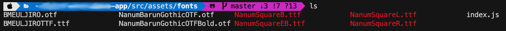

# 🔥 react-native font 설정

먼저 react-native-config.js를 다음과 같이 작성한다.


module.exports = {
  project: {
    ios: {},
    android: {},
  },
  assets: ['./src/assets/fonts/'],
};


그리고, src/assets/fonts 폴더 아래에 쓰고 싶은 font 파일들을 모두 가져다 놓는다.

마지막으로 다음 명령어를 치면 android와 ios의 assets에 font들이 모두 추가된다!


$ react-native link


react-native-vector-icons의 font뿐만 아니라 모든 font들에 대해 똑같이 적용이 가능하다.