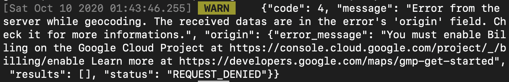

# ❎ 에러 발생

react-native에서 react-native-maps 패키지를 이용해 지도 기능을 구현하다가 다음과 같은 에러 메시지를 받았다.

> Error Message: You must enable Billing on the Google Cloud Project at https://console.cloud.google.com/project/_/billing/enable

# 🌟 해결

에러 메시지대로 [https://console.cloud.google.com/project/\_/billing/enable](https://console.cloud.google.com/project/_/billing/enable) 에 접속해서 프로젝트 결제정보를 등록하니 문제가 해결되었다.