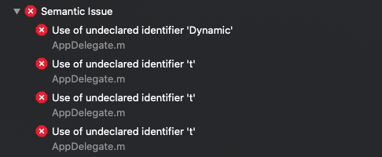
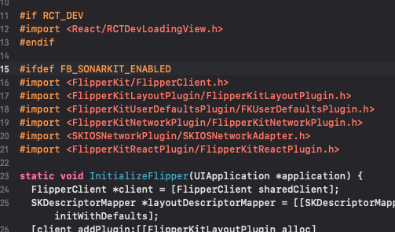

# ❎ 에러 발생

ios build는 잘되는데 archive시에만 해당 에러가 터진다. Xcode를 욕하면서 찾아보다가 github issue에서 다음과 같은 글을 보고 엄청난 실수를 깨달았다..

# 🌟 해결

[ https://github.com/transistorsoft/react-native-background-fetch/issues/247 ](https://github.com/transistorsoft/react-native-background-fetch/issues/247)

바로 저 #ifdef FB_SONARKIT_ENABLED 전처리기 안에 릴리즈 빌드에 필요한 헤더를 넣어둬서 아카이브시에만 에러가 생겼던 것이다..

다시는 실수 하지 않고, 또 다른 사람들이 고통받지 않았으면 해서 이렇게 기록한다!
