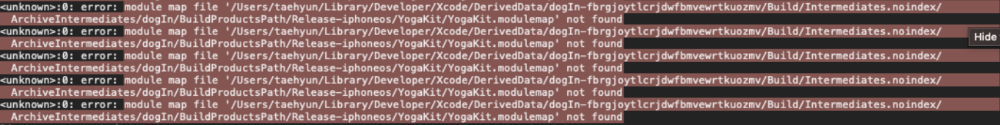
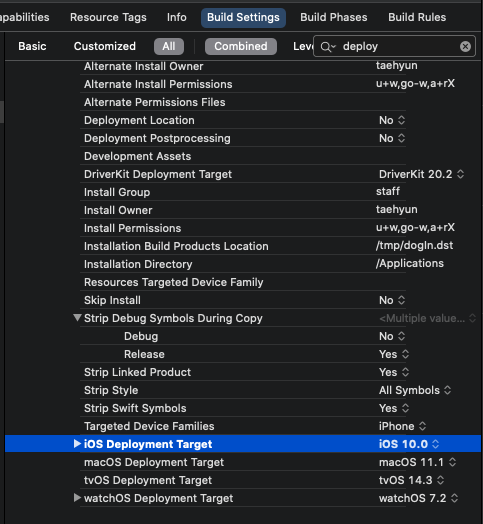
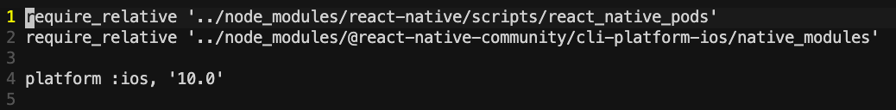

# ❎ 에러 발생

ios archive 중 module not found error가 터졌다.

해당 이슈를 검색해보니 ios deployment 타겟 버전이 Podfile에 명시되어 있는 버전과 달라 생기는 문제였다.

# 🌟 해결

* ## Xcode -> Build Setting 에서 Deployment를 검색하고 해당 target과

    

* ## Podfile 상단의 ios 플랫폼 버전을 똑같이 맞춘다.

    
