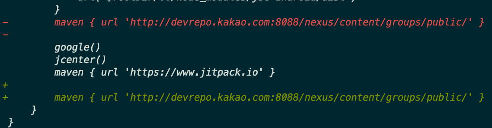

# ❎ 에러 발생

react-native project에서 firebase noti를 받기 위한 세팅 설정을 하다가 다음과 같은 에러를 만났다. 잘 빌드가 되어서 테스트까지 모두 했었는데 왜 갑자기 이런 에러가 터질까..

```console
>  Task :react-native-firebase_firestore:javaPreCompileDebug FAILED

Deprecated Gradle features were used in this build, making it incompatible with Gradle 7.0.
Use '--warning-mode all' to show the individual deprecation warnings.
See https://docs.gradle.org/6.0.1/userguide/command_line_interface.html#sec:command_line_warnings
60 actionable tasks: 2 executed, 58 up-to-date

FAILURE: Build failed with an exception.

* What went wrong:
Execution failed for task ':react-native-firebase_firestore:javaPreCompileDebug'.
> Could not resolve all files for configuration ':react-native-firebase_firestore:debugCompileClasspath'.
   > Could not find okhttp-2.7.5.jar (com.squareup.okhttp:okhttp:2.7.5).
     Searched in the following locations:
         http://devrepo.kakao.com:8088/nexus/content/groups/public/com/squareup/okhttp/okhttp/2.7.5/okhttp-2.7.5.jar
```


역시나 찾아보니 나와 같은 문제를 가진 사람들이 있었다.
[https://devtalk.kakao.com/t/okhttp-3-0-0-jar/78023](https://devtalk.kakao.com/t/okhttp-3-0-0-jar/78023)

# 🌟 해결

android/build.gradle에서 kakao repo를 제일 마지막으로 옮기니 해결 되었다.

