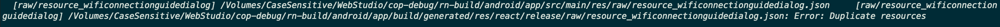

# react native release build error

react-native bundle --platform android --dev false --entry-file index.js --bundle-output android/app/src/main/assets/index.android.bundle --assets-dest android/app/src/main/res/ls

android 폴더에 들어가서 ./gradlew assembleRelease를 하면 종종 아래와 같은 에러를 만날 수 있다.

에러 문구 그대로 res가 겹쳐서 생긴 문제인데

/android/app/src/main/res 폴더에 들어가서 drawable 폴더를 삭제하고 다시 실행하면 문제가 해결된다.
