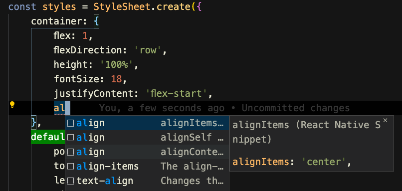

# VSCode react-native style autocomplete

VScode에서 react-native style 자동 완성 기능을 지원해주는 extension을 찾아보다가 다음 extension을 발견했다.

[ https://marketplace.visualstudio.com/items?itemName=jundat95.react-native-snippet ](https://marketplace.visualstudio.com/items?itemName=jundat95.react-native-snippet)

최근들어 가장 만족하는 extension인 것 같다!