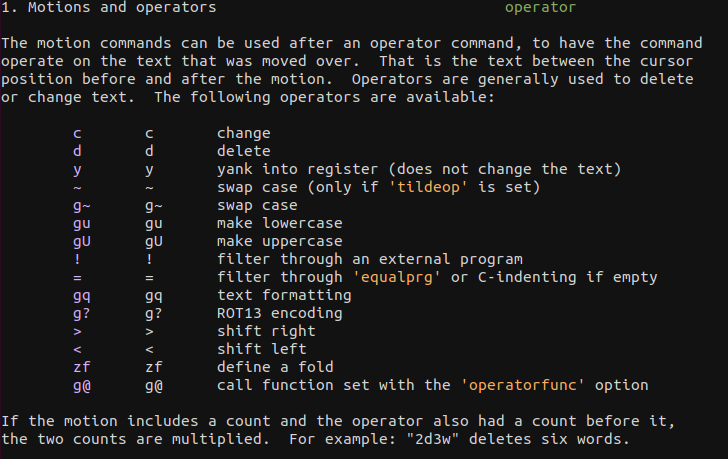

VIM을 접하고 난지 대략 1년 반이라는 시간이 지났다. 처음 회사업무가 IDE를 사용하지 못하는 환경이라 개발 환경을 VIM으로 세팅하여 사용했다. 지금은 어떤 IDE를 사용해도 먼저 VIM 환경 설정을 하는 방법부터 찾아보는 VIM 머글이 되었지만..

먼저 VIM을 쓰면서 VIM의 다양한 command와 mode에 대해 설명하려고 한다. 나 또한 정리를 하면서 다시 곱씹을 수 있는 기회가 되면 좋겠다!

# vim mode
vim은 modal editor이다. 모드가 여러개 있는 editor라는 말인데..
mode가 하나만 존재하는 가장 대표적인 editor가 바로 메모장이다. (입력 모드 정말 하나뿐)

vim에는 Basic Mode 6가지와 Additional Mode 6가지가 존재한다.

* Basic Mode
  * Normal
  * Visual
  * Select
  * Insert
  * Command-line
  * Ex
* Additional mode
  * Operator-pending
  * Replace
  * Virtual Replace
  * Insert Normal
  * Insert Visual
  * Insert Select

이번에 vim 공식문서를 보면서 이렇게 많이 모드가 있는 것은 처음 알았다..

굉장히 보기에는 어렵지만 다 사용하지도 않으니 겁먹을 필요도 없는 것 같다. 여기서 4가지 모드만 잘 알면 된다.

Normal, Visual, Insert, Command-line 모드 4가지이다.

- ## Insert Mode
    Insert 모드는 말 그대로 입력 모드로 개발자가 코드를 입력할 수 있는 모드이다.

- ## Normal Mode
    Normal 모드는 개발자의 휴식공간이다. Normal 모드에서 코드 페이지를 방향기(h, j, k, l, ctrl-d, ctrl-u ...)를 이용해 마음껏 돌아다닐 수 있고, 원하는 곳으로 가서 다시 Inset 모드로 돌아갈 수 있다!

- ## Visual Mode
    Visual 모드는 보통 어디부터 어디까지 선택할게~ 이런 모드라고 생각하면 쉽다. 보통 어디부터 어디까지 선택해서 복붙해야지 이런 느낌으로 많이 사용한다.

- ## Command-line Mode
    Command-line 모드는 Normal 모드에서 :(colon)을 입력하면 switching 된다. 여기서 보통 vim의 다양한 명령모드를 입력할 수 있다. (보통 치환 명령어를 많이 사용한다. :%s/word/replace-word)

    /, ?를 눌러도 Command-line모드로 진입한다. 여기서는 검색할 문자를 입력하면 현재 코드 문서내에서 검색이 가능하다!

내가 알고 있었던 모드는 여기서 Basic Mode와 Operator-pending, Replace정도 였다.

하지만 정말 알고만 있었던 모드이고, vi로 코딩시에는 위의 4가지 모드만 알면 된다.

# VIM operator command

vim help 문서에서 가져온 operator command들이다.

역시나 다 알 필요는 없고 몇가지만 숙지하면 된다!

먼저 복붙을 할 줄 알아야 한다.

# 복사는 "y" command이다.

y는 yank의 줄임말로 '홱 잡아 당기다' 라는 의미를 가진다.
덧붙여 Stack Exchange의 아래 글을 인용하면
https://ell.stackexchange.com/questions/14632/why-does-yank-in-vim-mean-copy

vim의 buffer의 내용을 register(unnamed & yank register)로 pull (당기다 = 홱 잡아 당기다!?)의 의미를 가진다고 생각할 수 있을 것 같다. (register는 어렵게 생각하지 말고 단순히 text 저장 공간이라고 생각하면 된다.)

이정도의 의미 파악을 하고 이제 외우면 된다. ㅋㅋㅋㅋ

그리고 vim의 규칙에는 operator command를 2번 입력하면 한 줄에 대해 적용이 되기 때문에 yy의 경우 한 줄 복사가 된다.

# 붙여넣기는 "p" command이다.

p는 paste로 copy & paste의 그 paste이다.

p는 내 커서의 뒤로 붙여넣는 command이고, P는 내 커서의 앞으로 붙여넣는 command이다.

# 잘라내기는 "d" command이다.

d는 delete의 줄임말로 삭제한다는 의미이다. 하지만 잘라내기라고 말한 것은 d command 또한 buffer의 내용을 unnamed register(")로 복사하기 때문이다.

# 삭제 + 바로 입력모드는 "c" command이다.

입력 모드에서 단어 삭제 후 바로 입력하기 위해 사용하는 자주 쓰는 operator command이다.
