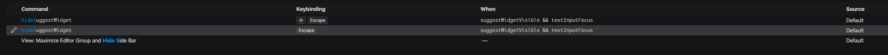
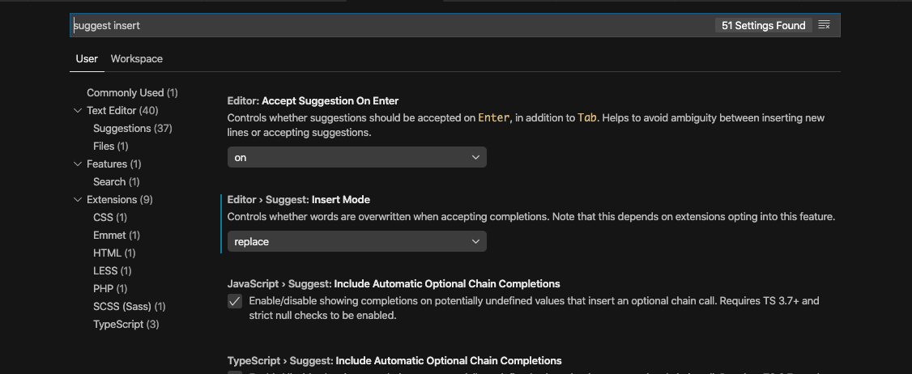

# VSCode에서 단축키 설정시, When에 2가지 조건을 넣기 위해서는 어떻게 해야할까?


VSCode를 사용중 vim normal 모드에서도 auto import suggest가 되도록 해야할 필요성을 느꼈다. 물론 다시 suggest를 끄는 단축키도.

단축키 설정에서 찾아보니 이미 hideSuggestWidget이라는 Command가 단축키 mapping이 되어있었지만 textInputFocus일때만 되어있어, vim normal mode에서는 작동하지 않았다.

따라서 When 조건에 or로 vim normal 모드일때도 작동하게 하려고 하기 위해 방법을 찾아보았다.

이미 등록된 단축키 설정들을 찾아보니 or 조건을 넣어야할때는 앞의 조건들을 다시 그대로 쓰고 추가하고 싶은 조건을 넣어야 했다.

예를 들어 (1) && (2) && textInputFocus 조건에 textInputFocus조건뿐만 아니라 vim normal 모드일때를 추가하고 싶다면 아래와 같이 작성해야 한다.

```
(1) && (2) && textInputFocus || (1) && (2) && vim.mode == Normal
```

다른 사람들에게도 도움이 되었으면 좋겠다.

# auto suggest mode를 insert에서 replace로 바꾸자



이미 작성된 코드에서 특정 모듈을 import하고 싶을때, 유용하다. 단어의 어느 위치에서 선택하더라도 현재 단어가 모두 바뀌기때문에 편하다.